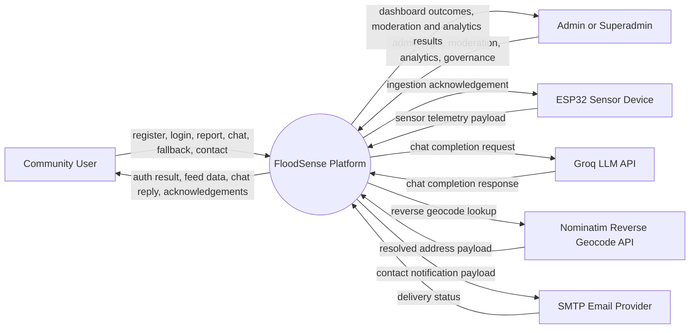
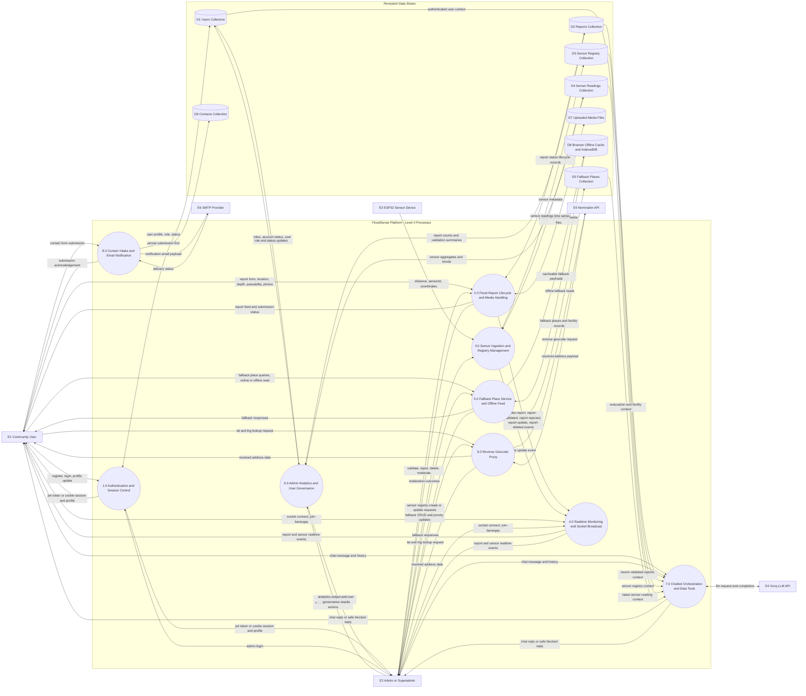

# FloodSense DFD Level 0 (Yourdon and Coad, Repo-Verified)

Generated: 2026-04-13  
Scope: Level 0 DFD based on implemented server and client code.

## 1. Goal

This model shows data movement between:

1. External entities
2. FloodSense Level 0 processes
3. Persistent data stores (server and browser-side offline stores)

## 2. Context-Level Reference (Image-Style)

This first view mirrors the sample image style: one central system process with request/response flows.

## 3. Level 0 DFD (Process Decomposition)

## 4. Process Catalog

1. P1 Authentication and Session Control: manages registration, login, JWT or cookie session validation, and profile/account actions.
2. P2 Flood Report Lifecycle and Media Handling: receives reports, handles moderation lifecycle, and persists uploaded report photos.
3. P3 Sensor Ingestion and Registry Management: ingests ESP32 telemetry and manages sensor registry metadata.
4. P4 Realtime Monitoring and Socket Broadcast: pushes report and sensor events to connected clients and barangay rooms.
5. P5 Fallback Place Service and Offline Feed: serves fallback places and populates browser offline stores.
6. P6 Admin Analytics and User Governance: generates weekly analytics and executes admin user role or status actions.
7. P7 Chatbot Orchestration and Data Tools: applies chat guardrails and optionally queries platform data via tools before replying.
8. P8 Contact Intake and Email Notification: saves contact submissions and sends outbound email notifications.
9. P9 Reverse Geocode Proxy: proxies coordinate-to-address lookups to Nominatim.

## 5. Data Store Catalog

1. D1 Users Collection: name, email, password hash, role, barangay, active status, last login.
2. D2 Reports Collection: reporter, barangay, geo location, depth, passability, status, validation notes, severity.
3. D3 Sensor Registry Collection: sensorId, locationName, coordinates, mountHeight, notes.
4. D4 Sensor Readings Collection: sensorId, location metadata, distance, timestamp.
5. D5 Fallback Places Collection: place name, category, barangay, geo location, priority, capacity, contact info.
6. D6 Contacts Collection: inbound contact form message records and status.
7. D7 Uploaded Media Files: report image files saved under uploads.
8. D8 Browser Offline Cache and IndexedDB: app shell and fallback place cache for offline reads.

## 6. Edge Notes to Annotate in Diagram

1. Chat prompt-injection patterns are blocked before model call, allowing safe fallback replies without contacting the LLM.
2. Contact flow persists to D6 before email dispatch, so submission success can still occur when SMTP is unavailable.
3. Sensor ingestion remains functional even if registry enrichment is missing, because readings are saved independently.
4. Sensor registry CRUD endpoints are currently exposed without explicit auth middleware in the route definitions.
5. Offline behavior is partial: app shell and fallbacks are cached, while live reports, live sensors, and chat still require network.
6. Report image uploads are constrained by file type and limits (max 3 images, max 5 MB each).
