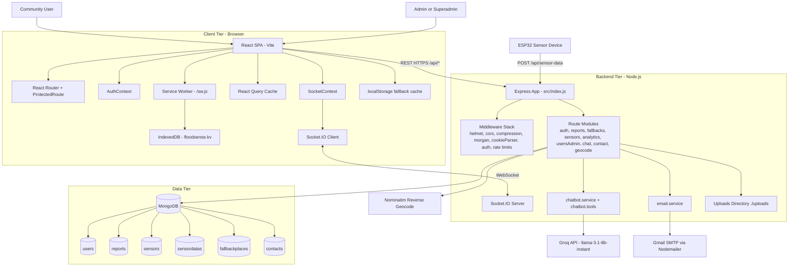
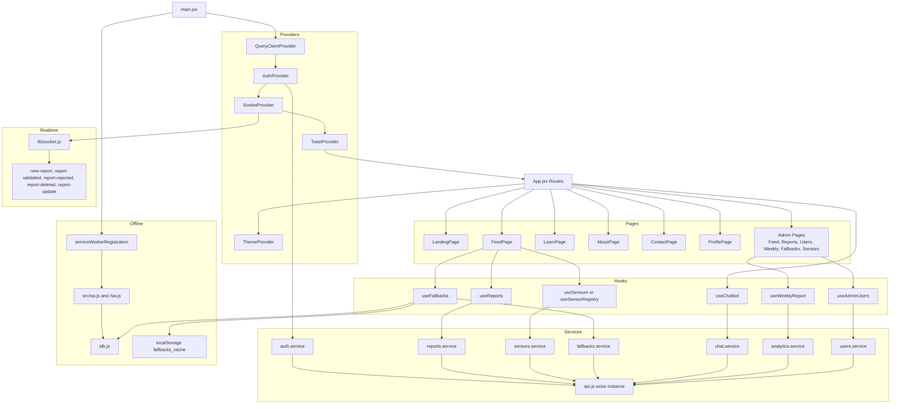
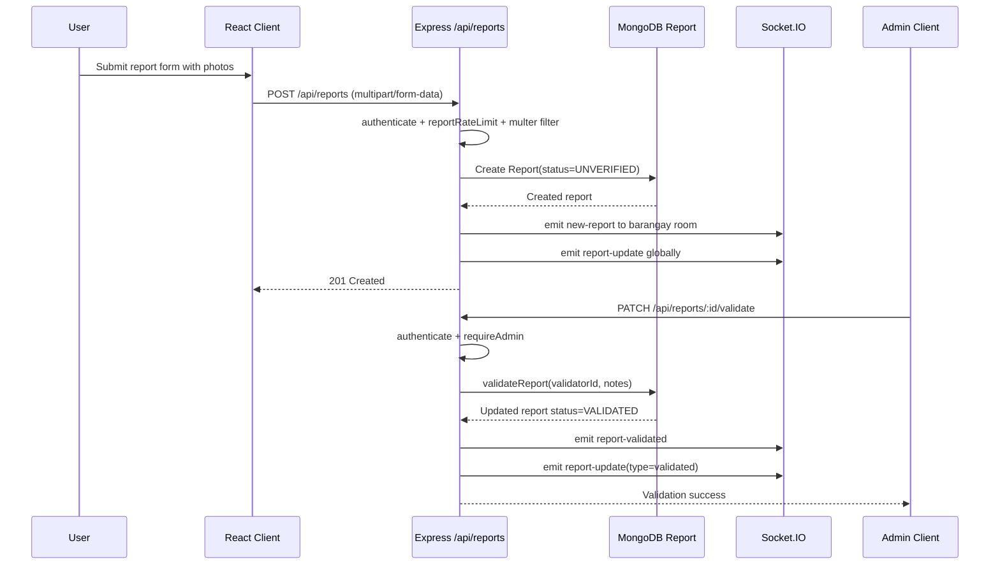
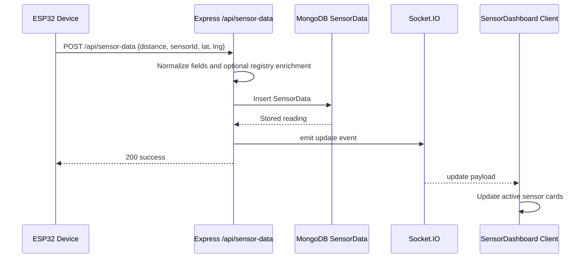
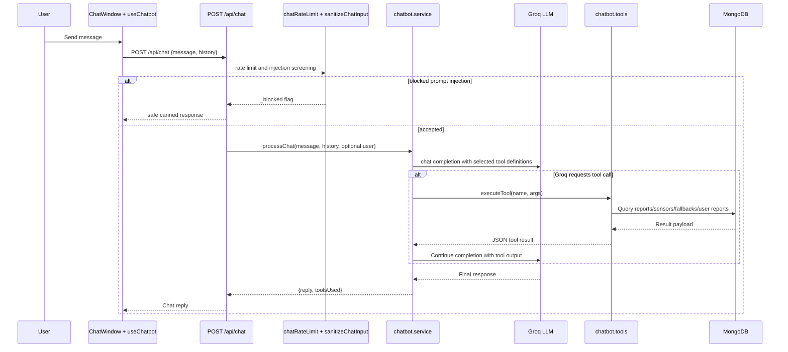
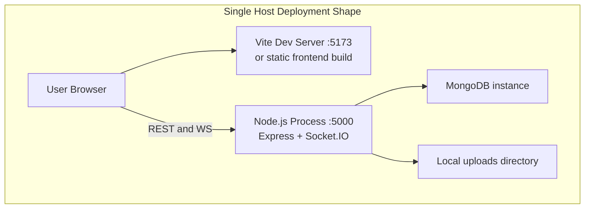

# FloodSense System Architecture (Repository-Wide Analysis)

Generated: 2026-04-13  
Scope: Full workspace architecture review across root scripts, frontend, backend, data layer, realtime channels, offline layer, and external integrations.

## 1. Architecture Overview

FloodSense is a full-stack, event-driven flood monitoring platform with these major layers:

1. Client layer: React + Vite SPA with route-protected admin features, React Query server-state caching, i18n, and Socket.IO client updates.
2. API and realtime layer: Express REST API + Socket.IO server in a shared Node.js process.
3. Data and storage layer: MongoDB (Mongoose models), local filesystem uploads, browser Cache Storage, IndexedDB, and localStorage.
4. Intelligence/integration layer: Groq LLM for chatbot, Nominatim reverse geocoding proxy, Nodemailer SMTP email notifications.

Operationally, it is a modular monolith (single backend runtime) with clear domain boundaries by route, model, middleware, and service module.

## 2. System Context Infrastructure Script



## 3. Backend Component Topology Script

```mermaid
flowchart LR
  Entry[src/index.js]
  SocketMod[src/socket.js]

  subgraph Middleware
    AuthMW[auth.js\nauthenticate, requireAdmin, requireSuperAdmin]
    RateMW[rateLimiting.js\nreportRateLimit, generalRateLimit]
    ChatMW[chatRateLimit.js\nchatRateLimit, sanitizeChatInput]
  end

  subgraph Routes
    AuthR[/api/auth]
    ReportsR[/api/reports]
    FallbackR[/api/fallbacks]
    SensorR[/api/sensor-data and /api/sensors]
    AnalyticsR[/api/admin/weekly-report]
    UsersAdminR[/api/admin/users]
    ChatR[/api/chat]
    ContactR[/api/contact]
    GeocodeR[/api/geocode/reverse]
  end

  subgraph Services
    ChatService[chatbot.service.js]
    ChatTools[chatbot.tools.js\nqueryEvacuationCenters\nqueryEmergencyFacilities\nqueryRecentReports\nquerySensorStatus\nqueryFallbackPlaces\nqueryUserReports\nqueryAreaRisk]
    MailService[email.service.js]
  end

  subgraph Models
    UserM[User]
    ReportM[Report]
    SensorM[Sensor]
    SensorDataM[SensorData]
    FallbackM[FallbackPlace]
    ContactM[Contact]
  end

  Entry --> SocketMod
  Entry --> AuthR
  Entry --> ReportsR
  Entry --> FallbackR
  Entry --> SensorR
  Entry --> AnalyticsR
  Entry --> UsersAdminR
  Entry --> ChatR
  Entry --> ContactR
  Entry --> GeocodeR

  AuthR --> AuthMW
  AuthR --> RateMW
  ReportsR --> AuthMW
  ReportsR --> RateMW
  FallbackR --> AuthMW
  FallbackR --> RateMW
  AnalyticsR --> AuthMW
  UsersAdminR --> AuthMW
  ChatR --> ChatMW

  AuthR --> UserM
  ReportsR --> ReportM
  ReportsR --> UserM
  FallbackR --> FallbackM
  SensorR --> SensorM
  SensorR --> SensorDataM
  AnalyticsR --> SensorDataM
  AnalyticsR --> ReportM
  UsersAdminR --> UserM
  ChatR --> ChatService
  ChatService --> ChatTools
  ChatTools --> FallbackM
  ChatTools --> ReportM
  ChatTools --> SensorM
  ChatTools --> SensorDataM
  ContactR --> ContactM
  ContactR --> MailService
```

## 4. Frontend Component Topology Script



## 5. Runtime Sequence Scripts

### 5.1 Flood Report Lifecycle (User to Admin Validation)



### 5.2 Sensor Data Ingestion and Live Update



### 5.3 Chatbot Function-Calling Path



## 6. API Surface (Verified from Code)

### 6.1 Authentication and Identity

- POST /api/auth/register
- POST /api/auth/login
- POST /api/auth/logout
- GET /api/auth/me
- PATCH /api/auth/me
- PATCH /api/auth/change-password

### 6.2 Flood Reports

- POST /api/reports
- GET /api/reports
- PATCH /api/reports/:id
- DELETE /api/reports/:id
- PATCH /api/reports/:id/validate
- PATCH /api/reports/:id/reject
- GET /api/reports/barangay/:barangay

### 6.3 Fallback Places

- GET /api/fallbacks
- GET /api/fallbacks/:id
- GET /api/fallbacks/category/evacuation-centers
- GET /api/fallbacks/category/emergency-facilities
- GET /api/fallbacks/barangay/:barangay
- POST /api/fallbacks
- PATCH /api/fallbacks/:id
- PATCH /api/fallbacks/:id/priority
- DELETE /api/fallbacks/:id

### 6.4 Sensors and IoT

- POST /api/sensor-data
- GET /api/sensor-data
- GET /api/sensor-data/latest
- GET /api/sensors
- GET /api/sensors/with-status
- POST /api/sensors
- PUT /api/sensors/:id
- DELETE /api/sensors/:id

### 6.5 Admin Analytics and Users

- GET /api/admin/weekly-report
- GET /api/admin/weekly-report/export?format=csv
- GET /api/admin/users
- PATCH /api/admin/users/:id/status
- PATCH /api/admin/users/:id/role

### 6.6 AI, Contact, Geocoding, Health

- POST /api/chat
- GET /api/chat/status
- POST /api/contact
- GET /api/geocode/reverse?lat=&lng=
- GET /api/ping

## 7. Realtime Contract (Socket.IO)

### 7.1 Server-Side Emits (active)

- new-report
- report-update
- report-validated
- report-rejected
- report-updated
- report-deleted
- update (sensor reading)
- joined-barangay
- left-barangay
- pong

### 7.2 Client Consumption

- SocketContext listens: new-report, report-validated, report-rejected, report-deleted, report-update.
- SensorDashboard listens: update.

## 8. Security and Trust Boundaries

1. Auth boundary:
   - JWT in bearer header or httpOnly cookie.
   - Role checks via requireAdmin and requireSuperAdmin.
2. API abuse boundary:
   - generalRateLimit (memory map).
   - reportRateLimit (DB-backed per user recent report check).
   - chatRateLimit (chat-specific memory map).
3. Input boundary:
   - chat message sanitization and prompt-injection filtering.
   - multer file type and size constraints for report photos.
4. Browser boundary:
   - offline fallback data in Service Worker cache + IndexedDB + localStorage.
5. External boundary:
   - Groq API key and SMTP credentials from environment variables.

## 9. Data Layer and Indexing Summary

- User: unique email, role index, barangay index, bcrypt pre-save hashing.
- Report: 2dsphere location index, barangay/status/time and reporter/time indexes, severity auto-calculation.
- FallbackPlace: 2dsphere location index, category/priority indexes, soft-delete via isActive.
- Sensor and SensorData: sensorId and timestamp indexes for latest-reading and history queries.
- Contact: simple persisted messages for support flow.

## 10. Notable Architecture Findings (Repository Analysis)

1. Misplaced module under server folder:
   - server/socket/socketHandler.js contains a React Leaflet component and frontend socket client logic, not backend socket handling.
   - This indicates file placement drift and potential maintenance confusion.

2. Sensor event naming mismatch:
   - Active backend emits update for sensor readings.
   - A separate map component expects sensorUpdate, floodDataUpdate, and newSensorData, but these are not emitted by active backend routes.

3. Sensor management route protection gap:
   - /api/sensors create/update/delete endpoints currently have no authenticate or requireAdmin middleware in route definitions.

4. Documentation vs implementation naming drift:
   - Admin analytics API path in code is /api/admin/weekly-report, while some docs mention /weekly.

5. Mixed client networking styles:
   - Axios services use base URL config (VITE_API_URL).
   - Some components use direct fetch('/api/...') relying on Vite proxy or same-origin deployment behavior.

## 11. Deployment View Script (Current Shape)



## 12. Practical Architecture Notes

1. Modular monolith advantages:
   - Fast local iteration and simpler operational overhead.
   - Shared in-process access to Socket.IO from routes.
2. Scalability constraints to monitor:
   - In-memory rate-limit maps are per-instance and non-distributed.
   - Socket room management assumes single-process memory unless external adapter is introduced.
   - Upload storage is local filesystem without object-store abstraction.
3. Offline behavior boundaries:
   - Reliable for cached fallback place content and shell routes.
   - Live sensors/reports/chat still depend on backend connectivity.

---

This file is intentionally implementation-focused and derived from current source behavior, not only from documentation intent.